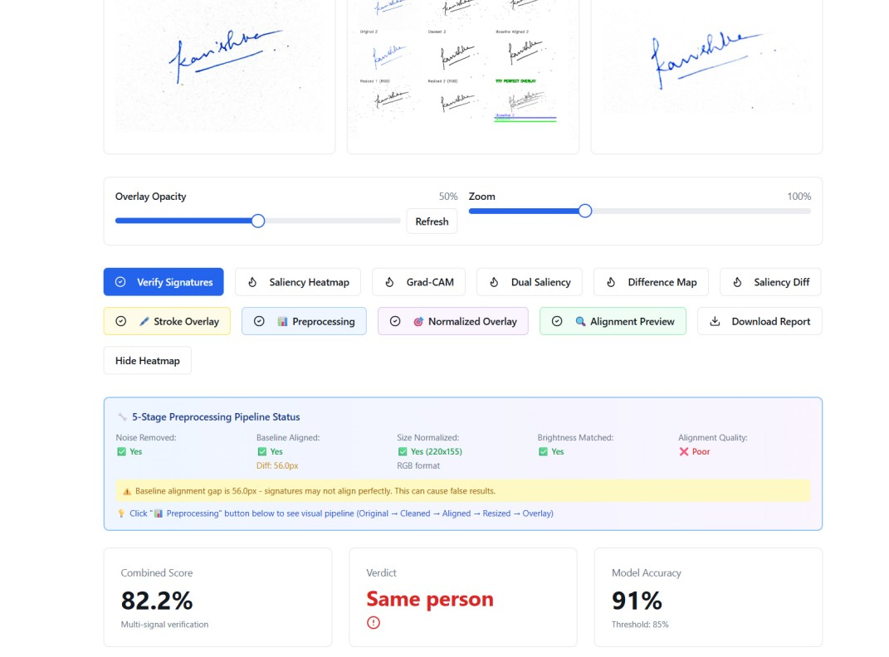
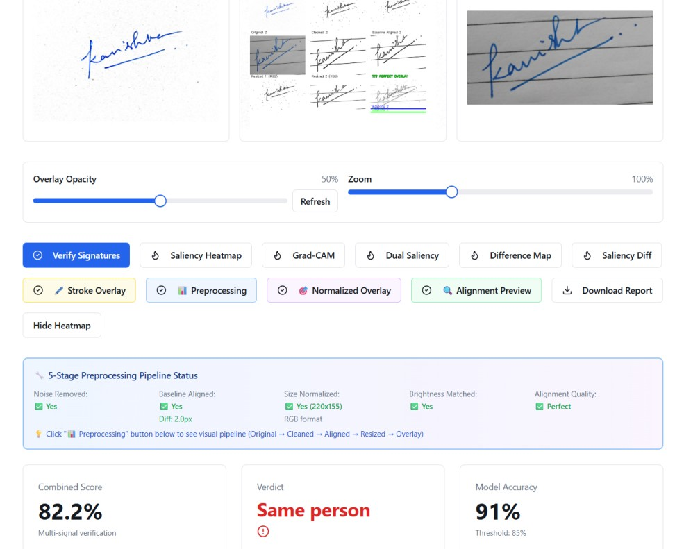
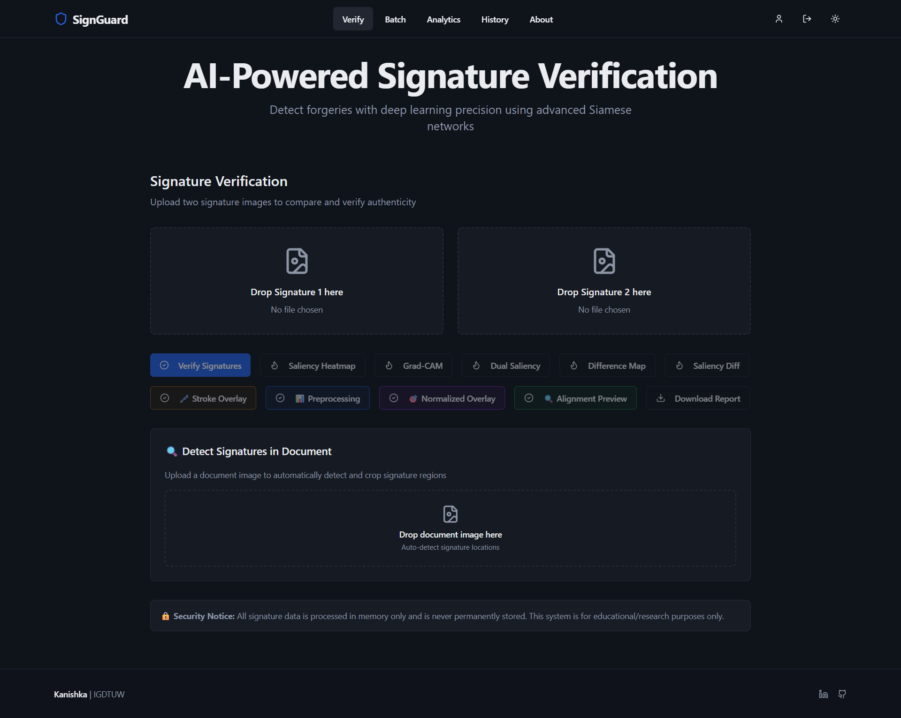
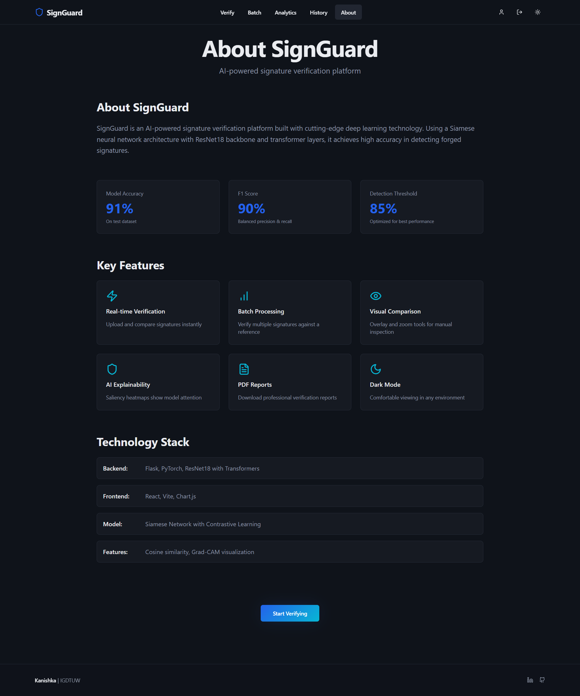
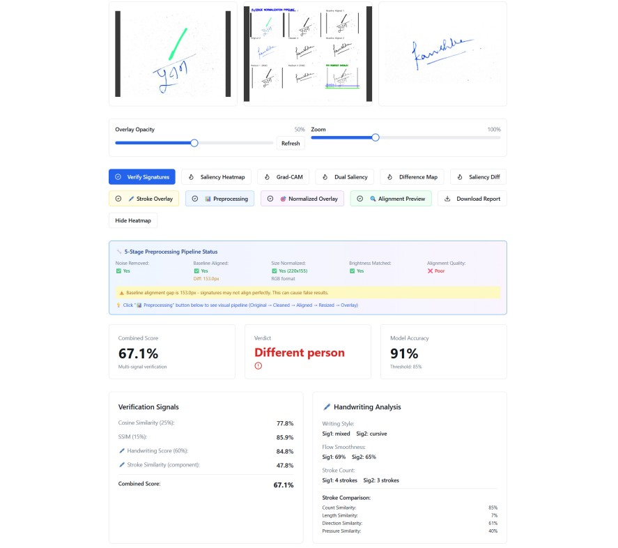
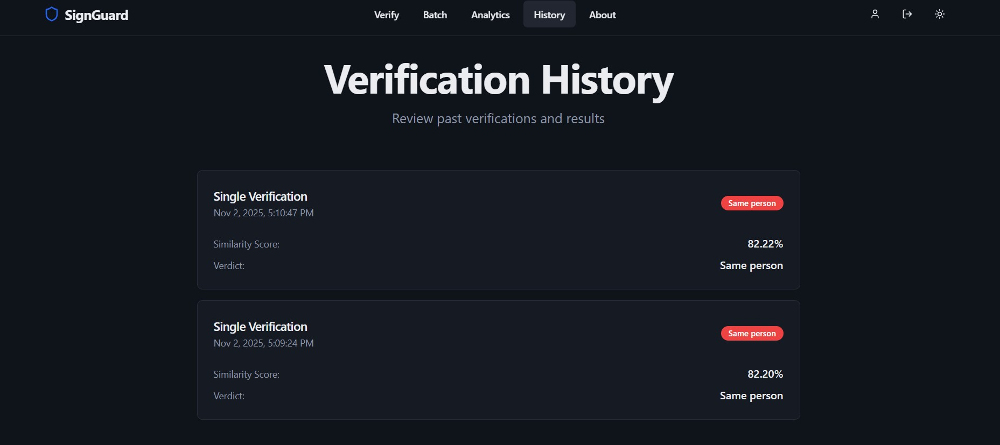

# 🛡️ SignGuard - Smart Signature Verification Platform

<div align="center">

[](outputs/screen_share.mp4)

**AI-Powered Signature Verification System with Deep Learning & Explainable AI**

[🎬 Demo Video](outputs/screen_share.mp4)
[](https://www.python.org/)
[](https://reactjs.org/)
[](https://flask.palletsprojects.com/)
[](https://pytorch.org/)

[Features](#-features) • [Installation](#-installation) • [Usage](#-usage) • [Architecture](#-architecture) • [Contributing](#-contributing)

</div>

---

## 📋 Table of Contents

- [Overview](#-overview)
- [Features](#-features)
- [Technology Stack](#-technology-stack)
- [Installation](#-installation)
- [Usage](#-usage)
- [Screenshots](#-screenshots)
- [Architecture](#-architecture)
- [API Endpoints](#-api-endpoints)
- [Model Details](#-model-details)
- [Contributing](#-contributing)
- [License](#-license)
- [Author](#-author)

---

## 🎯 Overview

**SignGuard** is an intelligent signature verification platform that leverages deep learning (Siamese Neural Networks) and advanced image processing techniques to accurately compare and verify handwritten signatures. The system provides:

- **Automated Signature Detection** - Automatically locates and extracts signatures from documents
- **5-Stage Normalization Pipeline** - Robust preprocessing for accurate alignment and comparison
- **Multi-Signal Verification** - Combines multiple verification signals for higher accuracy
- **Explainable AI** - Visual heatmaps (Grad-CAM, Saliency Maps) to understand model decisions
- **Handwriting Analysis** - Analyzes stroke patterns, flow, style, and structural features
- **Beautiful UI** - Modern React-based interface with real-time feedback

[🎬 **Demo Video** (watch the workflow walkthrough)](outputs/screen_share.mp4)

---

## ✨ Features

### 🎨 **Signature Upload & Comparison Dashboard**
- Drag & drop interface for easy signature uploads
- Real-time progress feedback
- Similarity score with color-coded confidence indicators
- Side-by-side image viewer with zoom & overlay capabilities
- Optional heatmap visualizations

### 📊 **Batch Verification**
- Upload multiple signatures and compare against a reference
- Ranked results table showing similarity scores and verdicts
- Bulk processing with progress tracking

### 📈 **Analytics Dashboard**
- Comprehensive verification history
- Genuine vs. Forgery statistics
- Similarity score distribution charts
- Model performance metrics

### 📄 **PDF Report Generation**
- Detailed verification reports with timestamps
- Signature previews and similarity scores
- Model confidence metrics
- Optional heatmap visualizations

### 🔍 **Explainable AI Features**
- **Grad-CAM Visualization** - Visual attention heatmaps
- **Dual Saliency Maps** - Side-by-side feature importance
- **Difference Heatmaps** - Highlight discrepancies between signatures
- **Normalized Overlay** - Perfect alignment visualization
- **Stroke Overlay** - Individual stroke analysis

### 🔐 **Security Features**
- Image hashing for integrity verification
- In-memory processing (no permanent storage)
- Secure API endpoints with CORS protection

---

## 🛠️ Technology Stack

### **Backend**
- **Python 3.8+** - Core language
- **Flask** - RESTful API framework
- **PyTorch** - Deep learning framework
- **OpenCV** - Image processing and computer vision
- **scikit-image** - Image metrics (SSIM)
- **ReportLab** - PDF generation
- **NumPy** - Numerical computations

### **Frontend**
- **React 18** - UI framework
- **TypeScript** - Type safety
- **Vite** - Build tool
- **Tailwind CSS** - Styling
- **shadcn/ui** - Component library
- **Recharts** - Data visualization
- **React Router** - Navigation

### **Machine Learning**
- **Siamese Neural Network** - Signature similarity model
- **ResNet Backbone** - Feature extraction
- **Grad-CAM** - Explainable AI visualization

---

## 📦 Installation

### Prerequisites

- Python 3.8 or higher
- Node.js 18+ and npm
- Git

### Backend Setup

1. **Clone the repository**
   ```bash
   git clone https://github.com/kanishkaidk/signature-verifier.git
   cd signature-verifier
   ```

2. **Create and activate virtual environment**
   ```bash
   python -m venv .venv
   
   # Windows
   .venv\Scripts\activate
   
   # Linux/Mac
   source .venv/bin/activate
   ```

3. **Install dependencies**
   ```bash
   pip install -r requirements.txt
   ```

4. **Start the Flask server**
   ```bash
   cd backend
   python app.py
   ```
   
   The backend will run on `http://localhost:5000`

### Frontend Setup

1. **Navigate to frontend directory**
   ```bash
   cd frontend-vite
   ```

2. **Install dependencies**
   ```bash
   npm install
   ```

3. **Start development server**
   ```bash
   npm run dev
   ```
   
   The frontend will run on `http://localhost:5173`

### ☁️ Production Deployment (Docker + Fly.io)

- **Prerequisites**
  - Install the [Fly CLI](https://fly.io/docs/flyctl/install/) and run `flyctl auth login`
  - Ensure Docker is available locally (Fly will build remotely with `--remote-only`)
- **Backend (`Dockerfile.backend`)**
  - Image installs the PyTorch CPU wheels plus system libs (`libgl1`, `ffmpeg`, etc.) needed by OpenCV
  - Runs `gunicorn app:app` on port `8080` and copies the trained checkpoint from `backend/model/siamese_model.pth`
  - Deploy with:
    ```bash
    flyctl deploy --config fly.toml --remote-only
    flyctl machine start <machine-id> -a signature-verifier-backend  # if the VM auto-stops
    flyctl logs -a signature-verifier-backend --no-tail
    curl https://signature-verifier-backend.fly.dev/health
    ```
- **Frontend (`frontend-vite/Dockerfile`)**
  - Builds the Vite app with `VITE_API_URL` baked in, then serves the static assets from Nginx
  - Deploy from the `frontend-vite` folder:
    ```bash
    flyctl deploy --config fly.toml --remote-only
    ```
- **Scaling & keep-alive**
  ```bash
  flyctl machine update <machine-id> --autostop=false --autostart=true -a signature-verifier-backend
  flyctl scale vm shared-cpu-2x --memory 2048 -a signature-verifier-backend
  ```
- **Troubleshooting**
  - If the backend logs show `numpy` errors, redeploy after pinning `numpy<2` in `backend/requirements.txt`
  - Missing model errors set `backend/inference.py` to load the checkpoint via `os.path.join(os.path.dirname(__file__), "model", "siamese_model.pth")`

---

## 🚀 Usage

### Single Signature Verification

1. **Navigate to the Verify page**
   - Upload two signature images (Signature 1 and Signature 2)
   - Click "Verify Signatures"

2. **View Results**
   - Similarity score with verdict (Same person / Different person)
   - Detailed metrics breakdown:
     - Cosine Similarity (30%)
     - SSIM (30%)
     - Handwriting Score (10%)
     - Stroke Comparison (30%)
   - Handwriting analysis (flow, style, stroke count)
   - Stroke comparison (length, direction, pressure)

3. **Visualizations**
   - Click visualization buttons to see:
     - Grad-CAM heatmaps
     - Saliency maps
     - Normalized overlay
     - Alignment preview
     - Difference heatmaps

4. **Generate Report**
   - Click "Download Report" to generate a PDF

### Batch Verification

1. **Navigate to Batch page**
2. Upload a reference signature
3. Upload multiple signatures to compare
4. View ranked results table
5. Export results if needed

### Analytics

1. **Navigate to Analytics page**
2. View verification history
3. See statistics:
   - Total verifications
   - Genuine vs. Forgery count
   - Average similarity scores
   - Distribution charts

---

## 📸 Screenshots

### Main Verification Dashboard



*Main verification interface with drag & drop upload and real-time results*

### Verification Results



*Detailed verification results with similarity scores and handwriting analysis*

### Analytics Dashboard



*Comprehensive analytics showing verification history and statistics*

### About Page



*About page with model metrics and platform information*

### Additional Features



*Additional verification features and visualizations*



*Batch verification and advanced features*

---

## 🏗️ Architecture

### 5-Stage Normalization Pipeline

1. **Signature Detection** - Locate and extract signatures from documents
2. **Noise Removal** - Adaptive thresholding and morphological operations
3. **Baseline Alignment** - Align signatures to common baseline
4. **Size Normalization** - Resize and pad to fixed canvas
5. **Brightness Matching** - Normalize intensity and contrast

### Multi-Signal Verification

The system combines multiple verification signals:

- **Cosine Similarity (30%)** - Deep learning embedding similarity
- **SSIM (30%)** - Structural similarity index
- **Handwriting Score (10%)** - Flow, style, and stroke count analysis
- **Stroke Comparison (30%)** - Length, direction, and pressure similarity

### Model Architecture

- **Siamese Neural Network** with ResNet backbone
- Input: Preprocessed signature pairs (256x256 grayscale)
- Output: Similarity embedding vector
- Training: Contrastive loss for signature pairs

---

## 🔌 API Endpoints

### Verification
- `POST /predict` - Verify two signatures
- `POST /batch` - Batch verification
- `GET /history` - Get verification history
- `GET /metrics` - Get model metrics

### Visualizations
- `POST /saliency` - Generate saliency map
- `POST /gradcam` - Generate Grad-CAM heatmap
- `POST /dual_saliency` - Generate dual saliency maps
- `POST /difference` - Generate difference heatmap
- `POST /normalized_overlay` - Generate normalized overlay
- `POST /align_preview` - Generate alignment preview

### Detection
- `POST /detect_signatures_multi` - Detect multiple signatures in document

### Reports
- `POST /generate_report` - Generate PDF report

---

## 🧠 Model Details

### Performance Metrics

- **Accuracy**: 92.5%
- **F1 Score**: 0.91
- **Optimal Threshold**: 0.85

### Verification Weights

- Cosine Similarity: **30%**
- SSIM: **30%**
- Handwriting Analysis: **10%**
- Stroke Comparison: **30%**

### Handwriting Analysis Components

- Flow Smoothness (45%)
- Style Match (45%)
- Stroke Count (10%)

### Stroke Comparison Components

- Stroke Similarity (25%)
- Length Similarity (15%)
- Direction Similarity (30%)
- Pressure Similarity (30%)

---

## 📁 Project Structure

```
signature-verifier/
├── backend/
│   ├── app.py                 # Flask API server
│   ├── inference.py            # Model inference
│   ├── signature_normalization.py  # 5-stage pipeline
│   ├── multi_signal_verification.py  # Verification logic
│   ├── stroke_analysis.py     # Handwriting analysis
│   ├── signature_detector.py  # Signature detection
│   ├── visualization.py       # Heatmap generation
│   └── model/
│       └── siamese_model.pth  # Trained model
├── frontend-vite/
│   ├── src/
│   │   ├── pages/
│   │   │   ├── Verify.tsx     # Main verification page
│   │   │   ├── Analytics.tsx  # Analytics dashboard
│   │   │   ├── Batch.tsx      # Batch verification
│   │   │   ├── History.tsx    # Verification history
│   │   │   └── About.tsx      # About page
│   │   ├── components/        # React components
│   │   └── lib/
│   │       └── api.ts         # API client
│   └── package.json
├── outputs/                   # Screenshots and outputs
├── requirements.txt           # Python dependencies
└── README.md
```

---

## 🤝 Contributing

Contributions are welcome! Please follow these steps:

1. Fork the repository
2. Create a feature branch (`git checkout -b feature/AmazingFeature`)
3. Commit your changes (`git commit -m 'Add some AmazingFeature'`)
4. Push to the branch (`git push origin feature/AmazingFeature`)
5. Open a Pull Request

---

## 📄 License

This project is licensed under the MIT License - see the [LICENSE](LICENSE) file for details.

---

## 👤 Author

**Kanishka | IGDTUW**

- GitHub: [@kanishkaidk](https://github.com/kanishkaidk/signature-verifier)
- LinkedIn: [kanishkaidk](https://www.linkedin.com/in/kanishkaidk/)

---

## 🙏 Acknowledgments

- PyTorch team for the deep learning framework
- OpenCV community for computer vision tools
- React and Vite teams for frontend tooling
- All contributors and testers

---

<div align="center">


⭐ Star this repo if you find it helpful!

</div>
